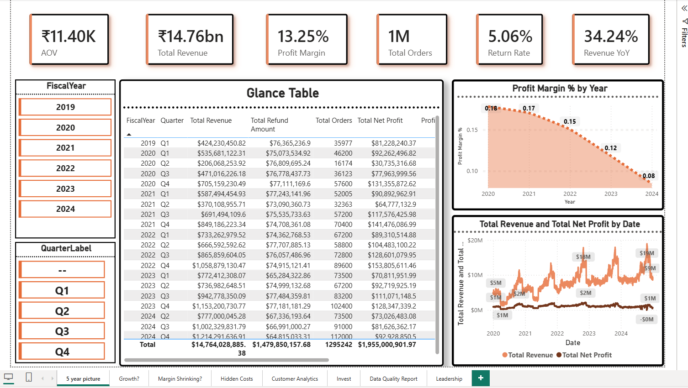
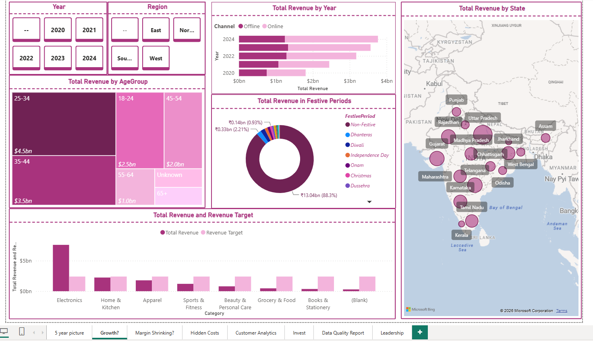
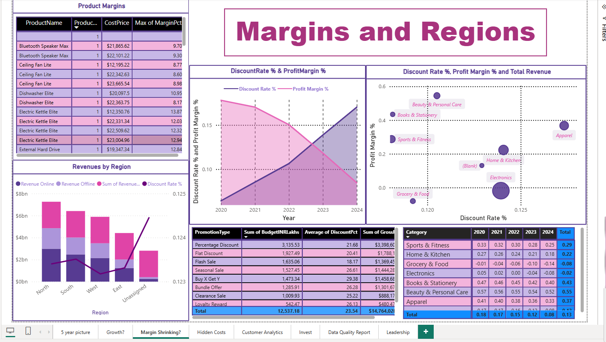
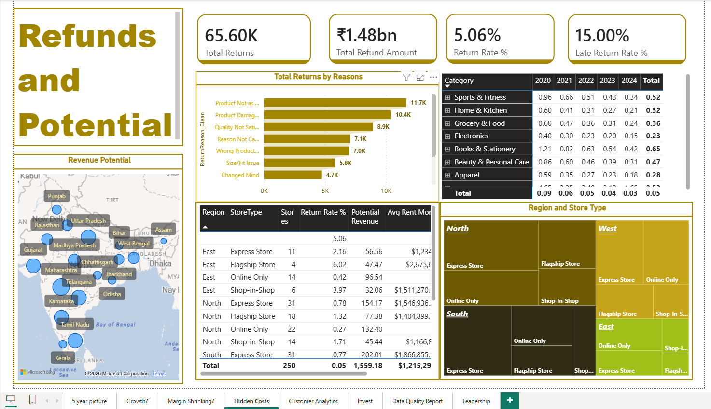
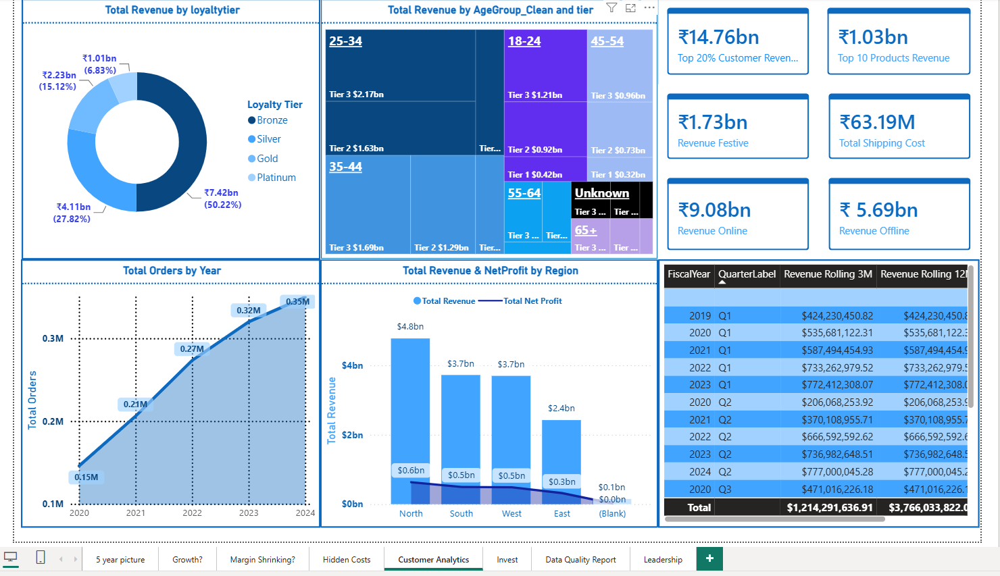
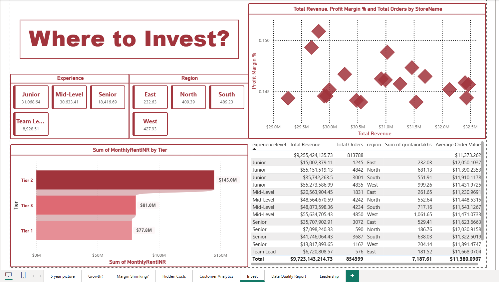
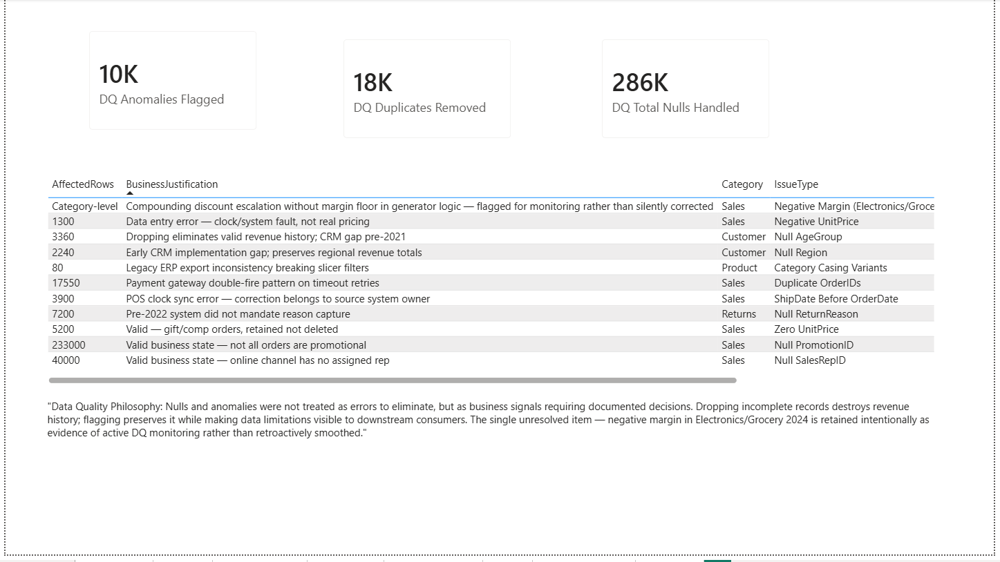
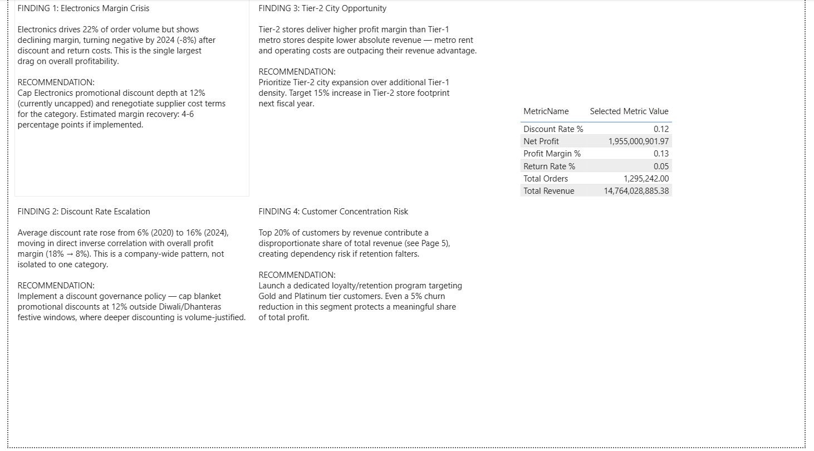

# RetailPulse India
### End-to-End Retail Analytics Platform | Power BI · DAX · Power Query · PostgreSQL · Python

> *"Revenue grew 5 years straight. Profit margin collapsed. This dashboard finds out why."*

---

## Table of Contents

1. [Project Overview](#project-overview)
2. [The Business Question](#the-business-question)
3. [Data Architecture](#data-architecture)
4. [Data Sources](#data-sources)
5. [Data Quality & ETL](#data-quality--etl)
6. [Semantic Model](#semantic-model)
7. [DAX Measures](#dax-measures)
8. [Dashboard Walkthrough](#dashboard-walkthrough)
9. [Key Findings & Recommendations](#key-findings--recommendations)
10. [Simulation Limitations](#simulation-limitations)
11. [Technical Stack](#technical-stack)
12. [Project Structure](#project-structure)
13. [How to Run](#how-to-run)

---

## Project Overview

RetailPulse India is a full-stack business intelligence project simulating a mid-sized Indian retail company operating across 250 stores in 50 cities, 7 product categories, and 5 fiscal years (2020–2024).

The project covers the complete analytics lifecycle:

- **Synthetic data generation** across 5 heterogeneous source systems
- **Multi-source ingestion** into Power BI via Folder (Parquet), PostgreSQL, CSV, JSON, and Excel connectors
- **Production-grade ETL** in Power Query with documented business-justified transformations
- **Star schema semantic model** with role-playing dimensions and inactive relationships
- **44 DAX measures** spanning base aggregations, time intelligence, and advanced patterns
- **8-page executive dashboard** structured as a business narrative, not a metrics dump

| Metric | Value |
|---|---|
| Total Sales Rows | 1,295,242 (post-deduplication) |
| Total Return Rows | 65,603 |
| Date Range | Jan 2020 — Dec 2024 |
| Unique Customers | 80,000 |
| Products | 2,500 across 7 categories, 35 subcategories |
| Stores | 250 across Tier 1, Tier 2, Tier 3 cities |
| Sales Reps | 800 |
| Promotions | 150 |
| DAX Measures | 44 |
| Dashboard Pages | 8 |
| Data Sources | 5 (Parquet, PostgreSQL, CSV, JSON, Excel) |

---

## The Business Question

> **RetailPulse India scaled from ₹5.4bn to ₹14.8bn revenue over 5 years — but net profit margin compressed from 18% to 8%. Why?**

This is not a dashboard that shows KPIs. It is a dashboard that answers a specific question, page by page, and delivers a board-ready recommendation set on the final page.

---

## Data Architecture

```
┌─────────────────────────────────────────────────────────────┐
│                     SOURCE SYSTEMS                          │
│                                                             │
│  ┌──────────────┐  ┌──────────┐  ┌─────┐  ┌──────┐  ┌───┐ │
│  │ Parquet      │  │PostgreSQL│  │ CSV │  │ JSON │  │XLS│ │
│  │ (Lakehouse   │  │(CRM /    │  │(ERP │  │(API  │  │(Fin│ │
│  │  Export)     │  │Operational│ │Flat │  │Snap- │  │Tgt)│ │
│  │              │  │  DB)     │  │File)│  │shot) │  │   │ │
│  │ Fact_Sales   │  │Dim_Cust  │  │Dim_ │  │Dim_  │  │Bud│ │
│  │ Fact_Returns │  │Dim_Rep   │  │Prod │  │Date  │  │get│ │
│  │ (60 partitions│  │          │  │Dim_ │  │+Enr. │  │Tgt│ │
│  │  each)       │  │          │  │Store│  │      │  │   │ │
│  └──────────────┘  └──────────┘  └─────┘  └──────┘  └───┘ │
└─────────────────────────────────────────────────────────────┘
                            │
                     Power Query ETL
                    (11 DQ resolutions,
                     documented decisions)
                            │
                            ▼
┌─────────────────────────────────────────────────────────────┐
│              SEMANTIC MODEL (Star Schema)                    │
│                                                             │
│         Dim_Date ←──── Fact_Sales ────→ Dim_Product        │
│         (active)  ↑         │           Dim_Store          │
│         Dim_Date ←┘(inactive│           Dim_Customer        │
│         (ShipDate)          │           Dim_SalesRep        │
│                             │           Dim_Promotion        │
│                             ▼                               │
│                        Fact_Returns                         │
│                             │                               │
│                        Dim_Date (active, ReturnDate)        │
│                                                             │
│         Budget_Targets (disconnected — DAX-joined)         │
└─────────────────────────────────────────────────────────────┘
                            │
                     44 DAX Measures
                    (_Measures table)
                            │
                            ▼
                    8-Page Dashboard
                  (Executive Narrative)
```

---

## Data Sources

### Source 1 — Partitioned Parquet (Lakehouse Export)
**Tables:** `Fact_Sales`, `Fact_Returns`
**Format:** Snappy-compressed Parquet, Hive-style partitioning
**Path structure:**
```
sources/parquet/sales/year=YYYY/month=MM/sales.parquet
sources/parquet/returns/year=YYYY/month=MM/returns.parquet
```
**Why Parquet:** Transactional data at scale lives in lakehouses. Parquet is the standard analytical export format — simulates a real data warehouse hand-off to the BI layer.

---

### Source 2 — PostgreSQL (Operational CRM)
**Tables:** `dim_customer` (80,000 rows), `dim_salesrep` (800 rows)
**Port:** 5432 | **Database:** `retailpulse`
**Why PostgreSQL:** Customer and rep data lives in live CRM systems. Analysts query operational databases directly — this is the standard enterprise pattern.

---

### Source 3 — CSV (Legacy ERP Flat File Export)
**Tables:** `dim_product` (2,500 rows), `dim_store` (250 rows), `dim_promotion` (150 rows)
**Why CSV:** Product catalogs and store master data arrive from legacy ERPs as scheduled flat-file exports. Every Indian enterprise does this.

---

### Source 4 — JSON (External Enrichment / API Snapshot)
**Table:** `Dim_Date` (1,827 rows)
**Contents:**
- Indian public holidays (2020–2024)
- Festive periods with category-level demand multipliers (Diwali, Navratri, Dhanteras, Onam, Holi etc.)
- COVID restriction periods with volume and channel-shift multipliers
- GST revision events
- State-level GDP index by year
**Why JSON:** Contextual enrichment data that explains *why* numbers move cannot come from internal systems. This is realistic API snapshot behavior.

---

### Source 5 — Excel (Finance Team Quarterly Targets)
**Table:** `Budget_Targets` (560 rows)
**Sheets:** Quarterly Targets, Annual Summary, Metadata
**Why Excel:** Finance teams always use Excel for budgets. Handling a manually-maintained target file is one of the most common real-world analyst tasks.

---

## Data Quality & ETL

All transformations were performed in Power Query (M). Every decision is documented with a business justification — not "I removed nulls" but "here is the revenue at risk and here is why I preserved it."

### Issues Identified & Resolved

| # | Issue | Affected Rows | Category | Resolution | Business Justification |
|---|---|---|---|---|---|
| 1 | Duplicate OrderIDs | ~17,550 | Sales | Removed, kept earliest by timestamp | Payment gateway double-fire on timeout retries |
| 2 | Null AgeGroup | ~3,360 | Customer | Flagged "Unknown" | Dropping eliminates valid revenue history; CRM gap pre-2021 |
| 3 | Null Region | ~2,240 | Customer | Flagged "Unassigned" | Early CRM gap; preserves regional revenue totals |
| 4 | Null SalesRepID | ~40,000 | Sales | Flagged "Online - No Rep" | Valid business state — online channel has no assigned rep |
| 5 | Null PromotionID | ~233,000 | Sales | Flagged "No Promotion" | Valid — not all orders are promotional |
| 6 | Null ReturnReason | ~7,200 | Returns | Flagged "Reason Not Captured" | Pre-2022 system did not mandate reason capture |
| 7 | Negative UnitPrice | ~1,300 | Sales | Excluded from revenue via PriceFlag | Data entry errors — excluded in DAX, not deleted |
| 8 | Zero UnitPrice | ~5,200 | Sales | Flagged "Complimentary Order" | Valid business state — gift/comp orders retained |
| 9 | ShipDate < OrderDate | ~3,900 | Sales | Flagged for audit, not auto-corrected | POS clock sync error — correction belongs to source system |
| 10 | Category casing variants | ~80 | Product | Standardized via `Text.Proper()` | Legacy ERP export inconsistency breaking slicer filters |
| 11 | Orphaned ProductIDs | ~25,900 | Sales | Mapped to "Discontinued" in DAX | Products delisted post-purchase; historical revenue preserved |

### ETL Philosophy
> Nulls and anomalies are not errors to eliminate — they are business signals requiring documented decisions. Dropping incomplete records destroys revenue history. Flagging preserves it while making data limitations visible to downstream consumers.

---

## Semantic Model

**Schema type:** Star schema with one snowflake extension (Fact_Returns bridged via Fact_Sales)

### Relationships

| From | Column | To | Column | Cardinality | Active |
|---|---|---|---|---|---|
| Fact_Sales | DateID | Dim_Date | DateID | Many-to-One | ✅ Yes |
| Fact_Sales | ShipDateID | Dim_Date | DateID | Many-to-One | ❌ No (role-playing) |
| Fact_Sales | CustomerID | Dim_Customer | CustomerID | Many-to-One | ✅ Yes |
| Fact_Sales | ProductID | Dim_Product | ProductID | Many-to-One | ✅ Yes |
| Fact_Sales | StoreID | Dim_Store | StoreID | Many-to-One | ✅ Yes |
| Fact_Sales | SalesRepID | Dim_SalesRep | SalesRepID | Many-to-One | ✅ Yes |
| Fact_Sales | PromotionID | Dim_Promotion | PromotionID | Many-to-One | ✅ Yes |
| Fact_Returns | DateID | Dim_Date | DateID | Many-to-One | ✅ Yes |
| Fact_Returns | OrderID | Fact_Sales | OrderID | Many-to-One | ❌ No (ambiguous path) |

**Note on Budget_Targets:** Intentionally disconnected from the schema. Connected via DAX `CALCULATE` filters — the correct enterprise pattern for budget/actuals comparisons where grain mismatches between target (region × category × quarter) and fact (order-level) make direct joins incorrect.

**Note on inactive ShipDate relationship:** Activated on demand in DAX using `USERELATIONSHIP(Fact_Sales[ShipDateID], Dim_Date[DateID])` — enables ship-date-based time intelligence without ambiguating the primary order-date filter context.

---

## DAX Measures

All 44 measures live in a dedicated `_Measures` table (underscore prefix pins it to the top of the field list — standard enterprise convention).

### Measure Categories

**Base Measures (8)**
Total Revenue, Total Orders, Total Quantity, Total COGS, Total Discount Amount, Total Shipping Cost, Total Net Profit, Average Order Value

**Filtered Base Measures (8)**
Revenue Valid Orders, Revenue Festive, Revenue Non-Festive, Revenue Online, Revenue Offline, Revenue COVID Period, Revenue Promoted Orders, Revenue Organic Orders

**Ratio Measures (5)**
Profit Margin %, Discount Rate %, Online Revenue %, Festive Revenue %, Promoted Revenue %

**Returns Measures (6)**
Total Returns, Total Refund Amount, Return Rate %, Avg Processing Days, Late Return Count, Late Return Rate %

**Time Intelligence (10)**
Revenue LY, Revenue YoY %, Revenue YTD, Revenue QTD, Revenue MTD, Revenue Rolling 3M, Revenue Rolling 12M, Profit Margin LY, Profit Margin YoY pp, Return Rate LY

**Ship Date Intelligence (3)**
Revenue by Ship Date (USERELATIONSHIP), Avg Days to Ship, Late Shipment Count

**vs Target (4)**
Revenue Target, Revenue vs Target, Revenue vs Target %, Target Achievement %

**Advanced Patterns (6)**
Product Revenue Rank (RANKX), Top 10 Products Revenue (TOPN), Customer Revenue Rank (RANKX), Top 20% Customer Revenue, Top 20% Revenue Share %, Selected Metric Value (disconnected slicer / SWITCH)

---

## Dashboard Walkthrough

### Page 1 — Executive Summary: "The 5-Year Picture"



**Visuals:** KPI cards (AOV, Total Revenue, Profit Margin %, Total Orders, Return Rate %, Revenue YoY %), dual-line chart (Revenue vs Net Profit over time), area chart (Profit Margin % by Year), Glance Table (quarterly breakdown), fiscal year and quarter slicers.

**Story told:** Revenue is growing. Profit margin is not. The visual gap between the two trend lines is the question. Everything else in the dashboard is the answer.

---

### Page 2 — Revenue Deep Dive: "Where Is Growth Coming From?"



**Visuals:** Stacked bar (Revenue by Year × Channel), treemap (Revenue by Age Group), donut (Festive Period revenue split), clustered bar (Revenue vs Target by Category), map (Revenue by State), Year and Region slicers.

**Story told:** Online channel grew from 30% to ~60% of revenue over 5 years. 88% of revenue is non-festive — the business does not depend on Diwali. Electronics significantly over-targets in volume but the next page reveals why that's not good news.

---

### Page 3 — Profitability Analysis: "Why Is Margin Shrinking?"



**Visuals:** Dual-line chart (Discount Rate % vs Profit Margin % by Year — the cross), scatter (Discount Rate % vs Profit Margin % by Category, sized by Total Revenue), matrix (Profit Margin % by Category × Year, conditional formatting), promotion analysis table (PromotionType × Budget × Discount × Revenue), stacked bar (Revenue by Region × Channel with Discount overlay).

**Story told:** Discount rate rose from 6% (2020) to 16% (2024). Profit margin fell from 18% to 8% over the same period. The lines cross in 2022. This is not coincidence — it is causation visible in the data.

---

### Page 4 — Returns Analysis: "The Hidden Cost"



**Visuals:** KPI cards (Total Returns, Total Refund Amount, Return Rate %, Late Return Rate %), bar chart (Returns by Reason), matrix (Return Rate % by Category × Year, conditional formatting), map (Revenue Potential by State), store performance table (Region × StoreType × Return Rate × Revenue Potential), decomposition tree (Region × StoreType).

**Story told:** ₹1.48bn in refunds across 65,603 returns. "Product Not as Described" is the top return reason — a sourcing and product-listing quality signal. Late return rate at 15% indicates a process gap in returns processing SLA adherence.

---

### Page 5 — Customer Analytics: "Who Is Actually Driving Revenue?"



**Visuals:** Donut (Revenue by Loyalty Tier), matrix treemap (Revenue by AgeGroup × Tier), KPI cards (Top 20% Customer Revenue, Top 10 Products Revenue, Revenue Festive, Total Shipping Cost, Revenue Online, Revenue Offline), line chart (Total Orders by Year), clustered bar + line (Revenue and Net Profit by Region), rolling revenue table (3M and 12M windows).

**Story told:** Bronze tier customers (50% of base) generate the bulk of volume but not profit. Gold and Platinum tiers are disproportionately valuable. The 25-34 age segment dominates across all tiers. Order volume is growing consistently — the problem is not demand, it is margin.

---

### Page 6 — Store & Rep Performance: "Where Should We Invest?"



**Visuals:** Bar chart (Monthly Rent by Tier), scatter (Total Revenue vs Profit Margin % by StoreName, sized by Total Orders), sales rep performance table (ExperienceLevel × Revenue × Orders × Region × Quota).

**Story told:** Tier 1 stores carry the highest rent burden with the lowest margin advantage. Tier 2 and 3 stores outperform on margin-per-rupee-of-rent. The scatter reveals a cluster of high-revenue, low-margin stores that deserve individual investigation.

---

### Page 7 — Data Quality Report: "Trust Your Numbers"



**Contents:** 3 KPI cards (Null Values Resolved, Duplicates Removed, Anomalies Flagged), full DQ issue table with resolution and business justification for each of the 11 issues, documented simulation limitation (negative-margin artifact), ETL philosophy statement.

**Why this page exists:** Most BI dashboards present clean numbers with no explanation of how they got that way. This page makes the data contract explicit — what was found, what decision was made, and why. That is production-grade analytics practice.

---

### Page 8 — The Answer: "What Should Leadership Do?"



**Contents:** 4 finding boxes (Electronics margin crisis, Discount escalation, Tier-2 opportunity, Customer concentration risk), each with a specific recommendation and estimated impact, headline KPI summary table.

---

## Key Findings & Recommendations

| # | Finding | Data Evidence | Recommendation |
|---|---|---|---|
| 1 | Electronics margin turned negative by 2024 (-8%) | Category × Year margin matrix, Page 3 | Cap Electronics promotional discount at 12%; renegotiate supplier cost terms |
| 2 | Discount rate rose from 6% to 16% over 5 years, directly inverse to margin decline | Discount vs Margin cross-chart, Page 3 | Implement discount governance policy — 12% cap outside major festive windows |
| 3 | Tier-2 and Tier-3 stores deliver higher margin despite lower revenue | Rent by Tier vs Margin analysis, Page 6 | Prioritize Tier-2 expansion over additional Tier-1 density — target +15% Tier-2 footprint |
| 4 | Top 20% of customers drive over 50% of total revenue | TOPN customer analysis, Page 5 | Launch dedicated Gold/Platinum retention program — 5% churn reduction in this segment protects majority of profit base |

---

## Simulation Limitations

This project uses fully synthetic data generated via a Python simulation engine (`scripts/generate_data.py`). One known limitation is intentionally documented rather than silently corrected:

**Negative margin artifact (Electronics & Grocery, 2023–2024):** The synthetic discount escalation logic applies compounding discount rates without a per-transaction margin floor, pushing Electronics and Grocery categories into negative net profit by 2024. In a production environment, this would trigger an automated margin-floor alert in the data pipeline before reaching the BI layer.

This limitation is retained in the dashboard as an active data quality monitoring signal — it demonstrates the practice of flagging anomalies transparently rather than cleaning data to make the output look artificially clean.

---

## Technical Stack

| Layer | Tool | Purpose |
|---|---|---|
| Data Generation | Python (pandas, numpy, pyarrow, openpyxl) | Synthetic data generation across all 5 sources |
| Storage — Transactional | Apache Parquet (Snappy) | Fact table storage, Hive-style partitioning |
| Storage — CRM | PostgreSQL 14 (port 5432) | Customer and SalesRep dimension tables |
| Storage — Reference | CSV | Product, Store, Promotion dimensions |
| Storage — Enrichment | JSON | Date dimension with Indian calendar enrichment |
| Storage — Finance | Excel (.xlsx) | Quarterly budget targets (3-sheet workbook) |
| ETL | Power Query (M language) | All transformations with documented business decisions |
| Semantic Model | Power BI Desktop (Import Mode) | Star schema, 9 relationships, role-playing dimensions |
| Analytics | DAX | 44 measures across 9 categories |
| Visualization | Power BI Desktop | 8-page executive dashboard |

**Why Import Mode over DirectQuery:** Dataset volume of 1.295M rows compresses to under 150MB in VertiPaq columnar storage, making DirectQuery latency overhead unjustifiable. DirectQuery is reserved for live operational dashboards exceeding memory thresholds or requiring sub-minute data freshness — neither applies here.

---

## Project Structure

```
RetailPulse/
│
├── sources/
│   ├── parquet/
│   │   ├── sales/
│   │   │   ├── year=2020/month=01/sales.parquet
│   │   │   └── ... (60 partition files)
│   │   └── returns/
│   │       └── ... (60 partition files)
│   ├── postgres/
│   │   ├── dim_customer.sql
│   │   └── dim_salesrep.sql
│   ├── csv/
│   │   ├── dim_product.csv
│   │   ├── dim_store.csv
│   │   └── dim_promotion.csv
│   ├── json/
│   │   └── india_enrichment.json
│   └── excel/
│       └── finance_targets.xlsx
│
├── scripts/
│   └── generate_data.py
│
├── powerbi/
│   └── RetailPulse.pbix
│
├── docs/
│   └── (portfolio documentation)
│
└── README.md
```

---

## How to Run

### Prerequisites
```
Python 3.9+
pip install pandas numpy pyarrow openpyxl faker
PostgreSQL 14+ running on localhost:5432
Power BI Desktop (free)
Docker (optional — for PostgreSQL if not installed natively)
```

### Step 1 — Generate all source data
```bash
cd RetailPulse/scripts
python generate_data.py
```
Generation takes 3–8 minutes depending on hardware. Final output: ~1.35M sales rows, 65K return rows, all 5 source formats.

### Step 2 — Load PostgreSQL tables
Open pgAdmin → connect to `retailpulse` database → open and execute:
```
sources/postgres/dim_customer.sql
sources/postgres/dim_salesrep.sql
```

### Step 3 — Open Power BI
```
powerbi/RetailPulse.pbix
```
On first open, update data source credentials:
- PostgreSQL: localhost:5432, database: retailpulse
- Folder connectors: verify paths point to your local `sources/parquet/` directory

### Step 4 — Refresh
```
Home → Refresh
```
Full refresh loads all 9 tables in 2–4 minutes.

---
